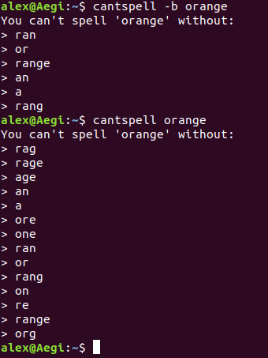

# cantspell 
(not a confession)

I was inspired to create this program when I drove past a church sign that read:
> You can't spell _challenge_ without _change_ 

Not because I was particularly moved by the sign, but rather the thought of "what else could you not spell challenge without" - or any word, for that matter.

---
## Explanation

This program takes an input word and returns a list of words that can be formed with an in-order subset of characters from the input word.

There are 2 types of searches that cantspell can perform. The first is a complex search (which is the default). Complex searching essentially gets all of the different combinations of in-order characters from the input word. The characters in each set of the complex search do not have to be adjacent.

A basic search finds all of the simple sub-strings of the input word. All of the characters must be adjacent.

Here is an example of the difference in output from a basic search and a complex search.

---
## Parameters

Here are the current command line parameters:  
* '-b' - stands for 'basic search'. Finds sub-words from __sequential__ letters in the input word with one starting point.
    * ex: 'orange' would find ['or', 'an', 'ran', 'rang', 'range', 'a']
    * By default this is turned off, in favor of a complex search.
* '-o' - stands for override validation. Normally, cantspell will check if the input word is a valid word before attempting to derive sub-words. By specifying this, cantspell will find sub-words for any input string.

---
